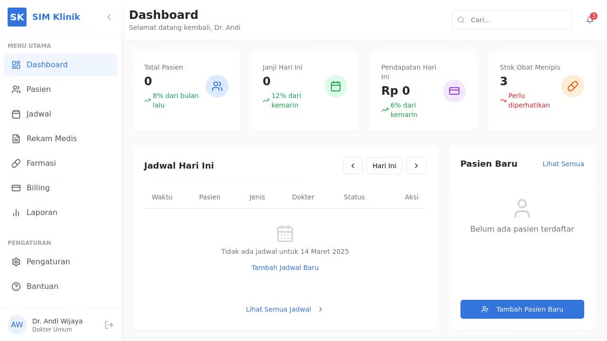
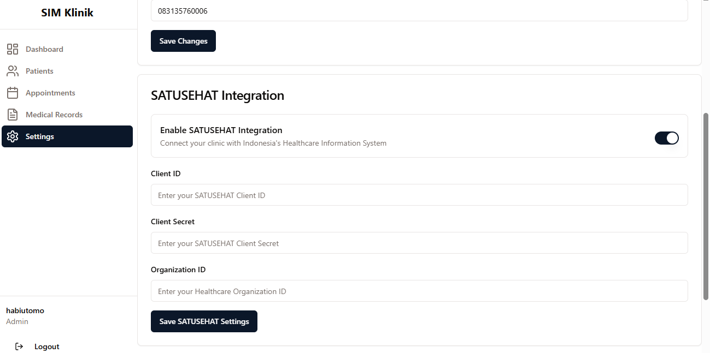

# Medical Clinic Management System

A web-based medical clinic management system built with React, Express, and TypeScript.




## Features

- Patient Registration and Management
- Medical Records Tracking 
- Appointment Scheduling
- Billing Management
- Doctor Management
- Medication Tracking
- Dashboard Analytics

## Tech Stack

- Frontend: React + TypeScript + Tailwind CSS
- Backend: Express + Node.js
- Database: PostgreSQL with Drizzle ORM
- Development: Vite

## Getting Started

1. Install dependencies:
```bash
npm install
```

2. Start the development server:
```bash
npm run dev
```

The application will start on port 5000 with the frontend being served through Vite's development server.

## Project Structure

```
├── client/          # Frontend React application
├── server/          # Express backend server
├── shared/          # Shared TypeScript types and schemas
```

## License
Silahkan email habizinnia@gmail.com - jika butuh repo ini
